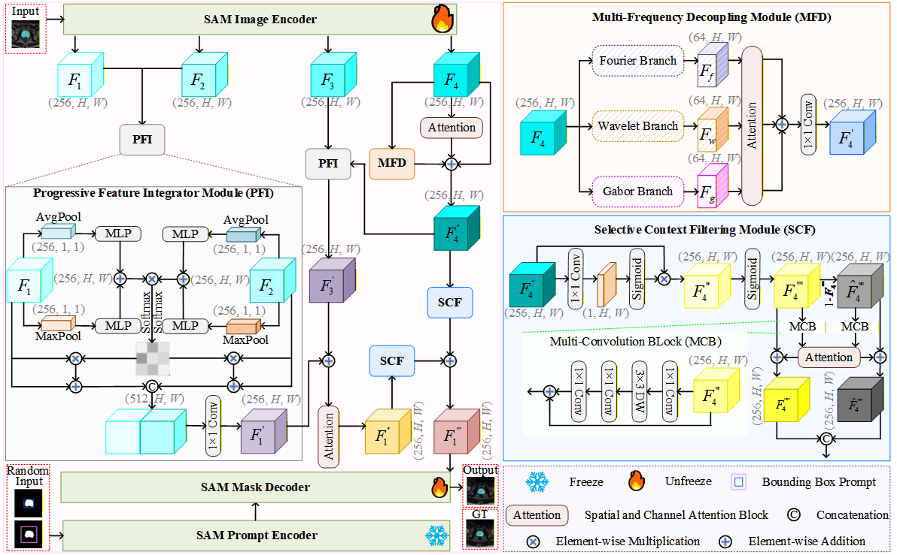

# :page_facing_up: One-shot is Enough: Boosting SAM for Medical Image Segmentation through Structured Information Modeling

<p align="center"></p>

### Dependency Preparation

```shell
cd OB-SAM
# Python Preparation
conda create -n OB-SAM python=3.10
activate OB-SAM
# It is recommended to use the conda installation on the Pytorch website https://pytorch.org/
pip install -r requirements.txt
```

### Model Training

```shell
# Model Train
# Please set the path of training image, training label in Train.py file.
python Train.py
```

###  Pre-trained Weights

We are making all the pre-trained weights for our experiments publicly available; you can access them by clicking the link below:
https://drive.google.com/file/d/1z2RQXAA9V964urYFyhOSWNogEhu5E8lV/view?usp=drive_link

### Citation ✏️ 📄

If you find this repo useful for your research, please consider citing the paper as follows:

```
The paper has not yet been accepted.
```
